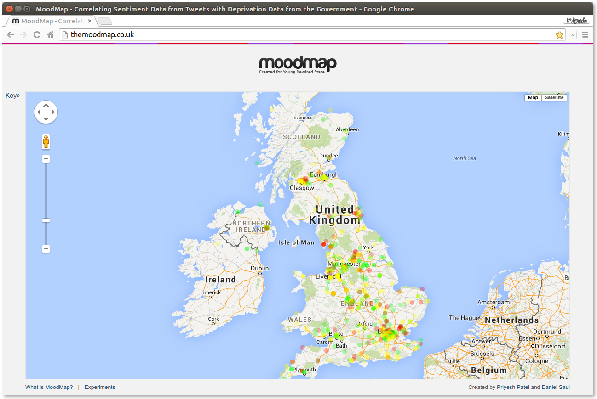
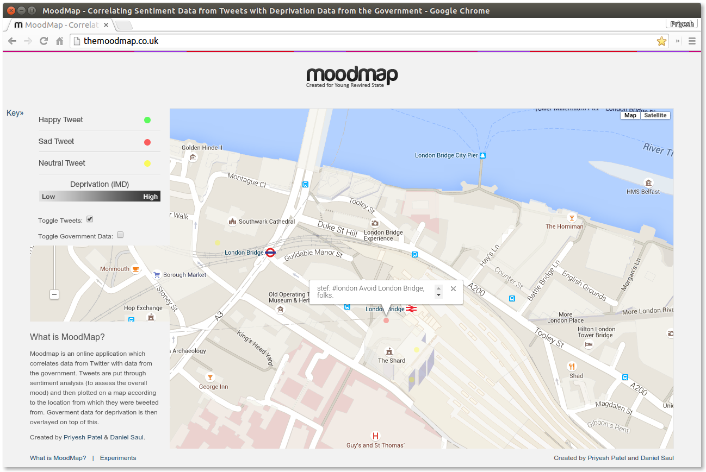
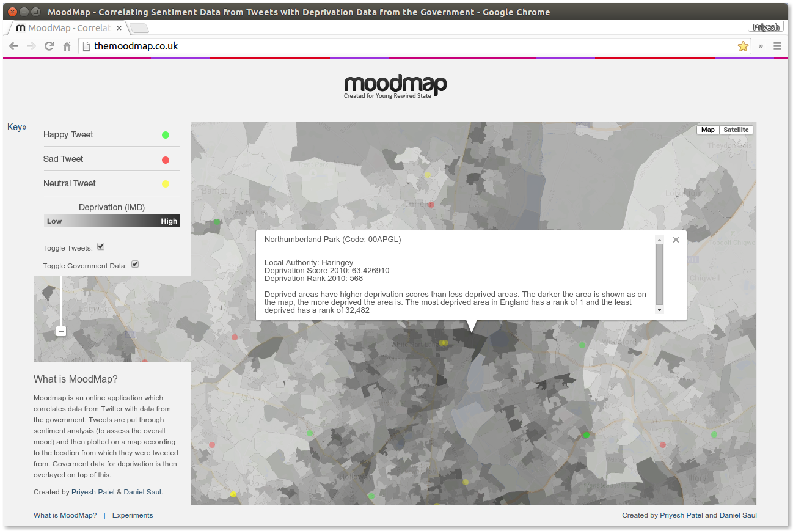

# MoodMap

## Plotting sentiment analysed tweets to show the mood of the country

MoodMap is an online application which correlates data from Twitter with data 
from the government. Tweets are put through sentiment analysis (to assess the 
overall mood) and then plotted on a map according to the location from which 
they were tweeted from. Goverment data for deprivation is then overlayed on 
top of this.

## Authors

 - Priyesh Patel
 - Daniel Saul

## Screenshots




## Setting up

### Dependencies

All dependencies are listed in `requirements.txt`. Inside your VirtualEnv
execute:

```bash
pip install -r requirements.txt
```

### Installation

It is recommended to run the MoodMap daemon with Supervisor. To do this setup
Foreman by copying `env.example` to `.env` and filling out the details. Foreman
can then be used to export a Supervisor configuration file:

```bash
foreman export supervisord ./
```

This resulting file will need to be edited so that `/bin/sh venv_<process>.sh`
is run as the command in each case and then added to the system's Supervisor
directory (often `/etc/supervisor/conf.d/`).

Supervisor can then be reloaded with `sudo supervisorctl reload`.

The web root should be set to `./web`.

CouchDB design docs are provided in `./couchdb`.

### ANEW Dataset

MoodMap utilises the ANEW (Affective Norms for English Words) dataset produced
by the [University of Florida](http://csea.phhp.ufl.edu/media/anewmessage.html).
The data is also available from other sources:
http://www.manifestdensity.net/2010/06/16/anew/.

The data should be imported into CouchDB and each doc should be formatted as
such:

```javascript
{
    "_id": XXX,
    "_rev": XXX,
    "word": "ball",
    "value": 6.00
}
```
